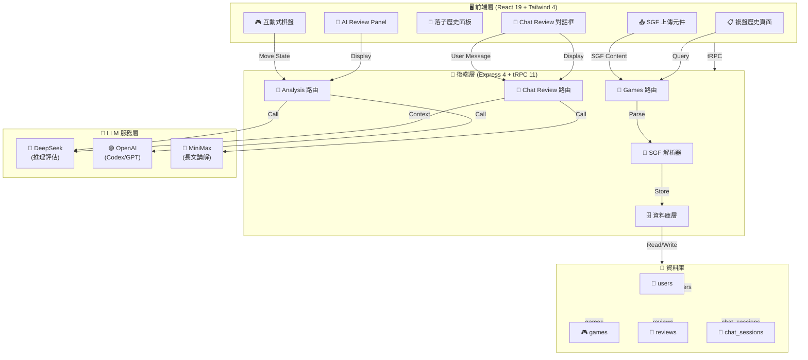

# AI 圍棋教練 — 系統架構文件

## 🏗️ 整體架構圖



---

## 📊 資料流圖

### 1. 棋譜上傳流程

```
使用者選擇 SGF 檔案
    ↓
前端驗證檔案格式
    ↓
上傳至 /api/trpc/games.upload
    ↓
後端驗證 SGF 內容
    ↓
SGF 解析器提取資訊
    ↓
儲存至 games 表
    ↓
返回 gameId
    ↓
前端重定向至 /review/:gameId
```

### 2. 單手棋分析流程

```
使用者點擊「分析此手」
    ↓
前端取得當前棋盤狀態
    ↓
呼叫 /api/trpc/analysis.analyzeMove
    ↓
後端構建 AI Prompt
    ↓
呼叫 LLM API (DeepSeek/OpenAI)
    ↓
解析 LLM 回應（JSON 格式）
    ↓
儲存至 reviews 表
    ↓
返回評估結果
    ↓
前端在 AI Review Panel 顯示
```

### 3. 全局複盤流程

```
使用者點擊「全局複盤」
    ↓
前端顯示進度條
    ↓
呼叫 /api/trpc/analysis.analyzeFullGame
    ↓
後端逐手分析（可能使用 queue）
    ↓
對每手棋呼叫 LLM API
    ↓
標記 blunder/mistake/questionable
    ↓
批量儲存至 reviews 表
    ↓
返回複盤統計
    ↓
前端顯示複盤報告
```

### 4. Chat Review 對話流程

```
使用者輸入問題
    ↓
呼叫 /api/trpc/chatReview.sendMessage
    ↓
後端取得棋盤狀態 + 對話歷史
    ↓
構建 Chat Review System Prompt
    ↓
呼叫 LLM API (MiniMax 或 DeepSeek)
    ↓
流式返回回應 (streaming)
    ↓
儲存訊息至 chat_sessions 表
    ↓
前端實時顯示 AI 回應
```

---

## 🗂️ 檔案結構

```
ai-go-coach/
├── client/
│   ├── src/
│   │   ├── pages/
│   │   │   ├── Home.tsx              # 首頁
│   │   │   ├── Review.tsx            # 複盤頁面
│   │   │   ├── History.tsx           # 複盤歷史
│   │   │   └── Settings.tsx          # 使用者設定
│   │   ├── components/
│   │   │   ├── GoBoard.tsx           # 棋盤元件
│   │   │   ├── MoveHistory.tsx       # 落子歷史面板
│   │   │   ├── AIReviewPanel.tsx     # AI 分析面板
│   │   │   ├── ChatReview.tsx        # Chat Review 對話框
│   │   │   └── SGFUpload.tsx         # 上傳元件
│   │   ├── hooks/
│   │   │   ├── useGoBoard.ts         # 棋盤邏輯 hook
│   │   │   ├── useGameState.ts       # 遊戲狀態 hook
│   │   │   └── useAIAnalysis.ts      # AI 分析 hook
│   │   ├── lib/
│   │   │   ├── sgf-parser.ts         # SGF 解析（客戶端工具）
│   │   │   └── board-utils.ts        # 棋盤工具函數
│   │   └── App.tsx
│   └── index.html
├── server/
│   ├── routers/
│   │   ├── games.ts                  # 棋譜管理路由
│   │   ├── analysis.ts               # AI 分析路由
│   │   └── chatReview.ts             # Chat Review 路由
│   ├── services/
│   │   ├── sgf-parser.ts             # SGF 解析服務
│   │   ├── ai-analysis.ts            # AI 分析服務
│   │   ├── llm-router.ts             # LLM API 路由層
│   │   └── board-state.ts            # 棋盤狀態管理
│   ├── db.ts                         # 資料庫查詢
│   └── routers.ts
├── drizzle/
│   └── schema.ts                     # 資料庫 schema
├── shared/
│   └── types.ts                      # 共享型別
├── DEVELOPMENT_SPEC.md               # 開發規格
├── ARCHITECTURE.md                   # 本文件
└── todo.md                           # 任務清單
```

---

## 🔌 API 契約

### tRPC 路由結構

```typescript
// games 路由
games: {
  upload(input: { title?, description?, sgfContent }): { gameId, message }
  list(): Array<{ id, title, playerBlack, playerWhite, uploadedAt }>
  get(input: { gameId }): { id, title, sgfContent, moves, metadata }
  delete(input: { gameId }): { success }
}

// analysis 路由
analysis: {
  analyzeMove(input: { gameId, moveNumber, boardState, lastMoves, playerToMove }): {
    evaluation, reason, suggestedMoves, strategy
  }
  analyzeFullGame(input: { gameId }): {
    summary, criticalMoves, blunders, mistakes, questionable
  }
  getReview(input: { gameId, moveNumber }): { review or null }
}

// chatReview 路由
chatReview: {
  sendMessage(input: { gameId, message, currentMoveNumber? }): {
    response, messageId
  }
  getHistory(input: { gameId }): Array<{ role, content, timestamp }>
  clearHistory(input: { gameId }): { success }
}
```

---

## 🧠 LLM 路由層設計

```typescript
// server/services/llm-router.ts

interface LLMRequest {
  type: 'move_analysis' | 'full_game_review' | 'chat_review';
  model?: 'deepseek' | 'openai' | 'minimax';
  messages: Array<{ role, content }>;
  systemPrompt: string;
  temperature?: number;
  maxTokens?: number;
}

async function invokeLLM(request: LLMRequest): Promise<string> {
  // 根據 type 選擇最適合的模型
  const model = selectModel(request.type, request.model);
  
  // 呼叫對應的 LLM API
  const response = await callLLMAPI(model, request);
  
  // 驗證與解析回應
  return parseResponse(response, request.type);
}

function selectModel(type: string, preferred?: string): string {
  if (preferred) return preferred;
  
  switch (type) {
    case 'move_analysis':
      return 'deepseek'; // 推理能力強
    case 'full_game_review':
      return 'deepseek'; // 需要邏輯推理
    case 'chat_review':
      return 'minimax'; // 長文本 + 講解能力
    default:
      return 'openai';
  }
}
```

---

## 🎨 前端元件樹

```
<App>
  ├── <Home>
  │   ├── <SGFUpload>
  │   ├── <RecentGamesList>
  │   └── <FeatureIntro>
  ├── <Review>
  │   ├── <GoBoard>
  │   │   ├── Canvas (棋盤渲染)
  │   │   └── <MoveHistory>
  │   ├── <AIReviewPanel>
  │   │   ├── <EvaluationBadge>
  │   │   ├── <ReasonText>
  │   │   ├── <SuggestedMoves>
  │   │   └── <StrategyDescription>
  │   └── <ChatReview>
  │       ├── <MessageList>
  │       ├── <MessageInput>
  │       └── <LoadingIndicator>
  ├── <History>
  │   ├── <GamesList>
  │   ├── <SearchBar>
  │   └── <DeleteButton>
  └── <Settings>
      ├── <UserProfile>
      └── <LogoutButton>
```

---

## 🔐 認證與授權流程

```
使用者訪問應用
    ↓
檢查 session cookie
    ↓
如無效 → 重定向至 OAuth 登入
    ↓
OAuth 回調 → 建立 session
    ↓
所有 tRPC 呼叫自動包含 ctx.user
    ↓
protectedProcedure 驗證使用者身份
    ↓
資料庫查詢自動過濾使用者資料
```

---

## 📈 性能優化策略

| 層級 | 優化策略 |
|------|---------|
| 前端 | Canvas 棋盤使用 requestAnimationFrame，避免重複渲染 |
| 前端 | React Query 快取 AI 分析結果 |
| 後端 | LLM 回應快取（相同棋盤狀態） |
| 後端 | 資料庫索引（userId, gameId, moveNumber） |
| 網路 | 對話流式傳輸（streaming response） |
| 網路 | 靜態資產 CDN 分發 |

---

## 🚀 部署架構

```
┌─────────────────────────────────────┐
│     Manus Hosting (Cloud Run)       │
├─────────────────────────────────────┤
│  ┌───────────────────────────────┐  │
│  │  Express Server + React SPA   │  │
│  │  (Node.js 22 runtime)         │  │
│  └───────────────────────────────┘  │
│           ↓                          │
│  ┌───────────────────────────────┐  │
│  │  MySQL Database (Manus DB)    │  │
│  └───────────────────────────────┘  │
└─────────────────────────────────────┘
           ↓
┌─────────────────────────────────────┐
│     外部 LLM 服務                   │
│  - DeepSeek API                     │
│  - OpenAI API                       │
│  - MiniMax API                      │
└─────────────────────────────────────┘
```

---

## 📝 開發工作流

1. **本地開發**: `pnpm dev` 啟動 Vite + Express
2. **資料庫遷移**: `pnpm drizzle-kit generate` → `webdev_execute_sql`
3. **測試**: `pnpm test` 執行 Vitest
4. **構建**: `pnpm build` 生成生產包
5. **部署**: 提交至 Manus 平台自動部署

---

## 🔍 監控與日誌

- **應用日誌**: `.manus-logs/devserver.log`
- **客戶端日誌**: `.manus-logs/browserConsole.log`
- **網路日誌**: `.manus-logs/networkRequests.log`
- **使用者互動**: `.manus-logs/sessionReplay.log`

---

## 📞 故障排除

| 問題 | 原因 | 解決方案 |
|------|------|---------|
| 棋盤不顯示 | Canvas 初始化失敗 | 檢查瀏覽器支援、console 錯誤 |
| AI 分析無回應 | LLM API 超時 | 增加超時時間、檢查 API 配額 |
| 棋譜上傳失敗 | SGF 格式無效 | 驗證 SGF 檔案、查看錯誤訊息 |
| 資料無法儲存 | 資料庫連接失敗 | 檢查 DATABASE_URL、執行遷移 |

---

**最後更新**: 2026-06-14  
**版本**: 1.0
